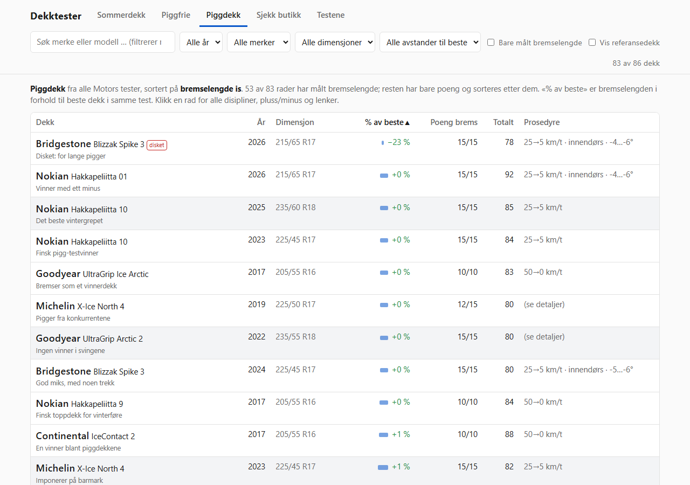
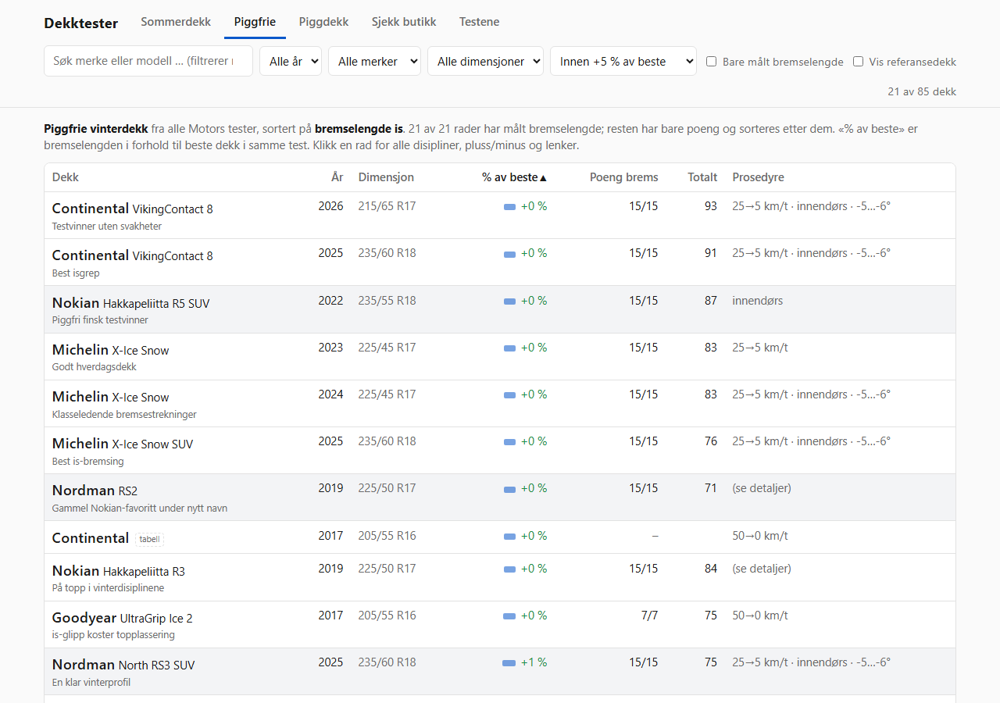
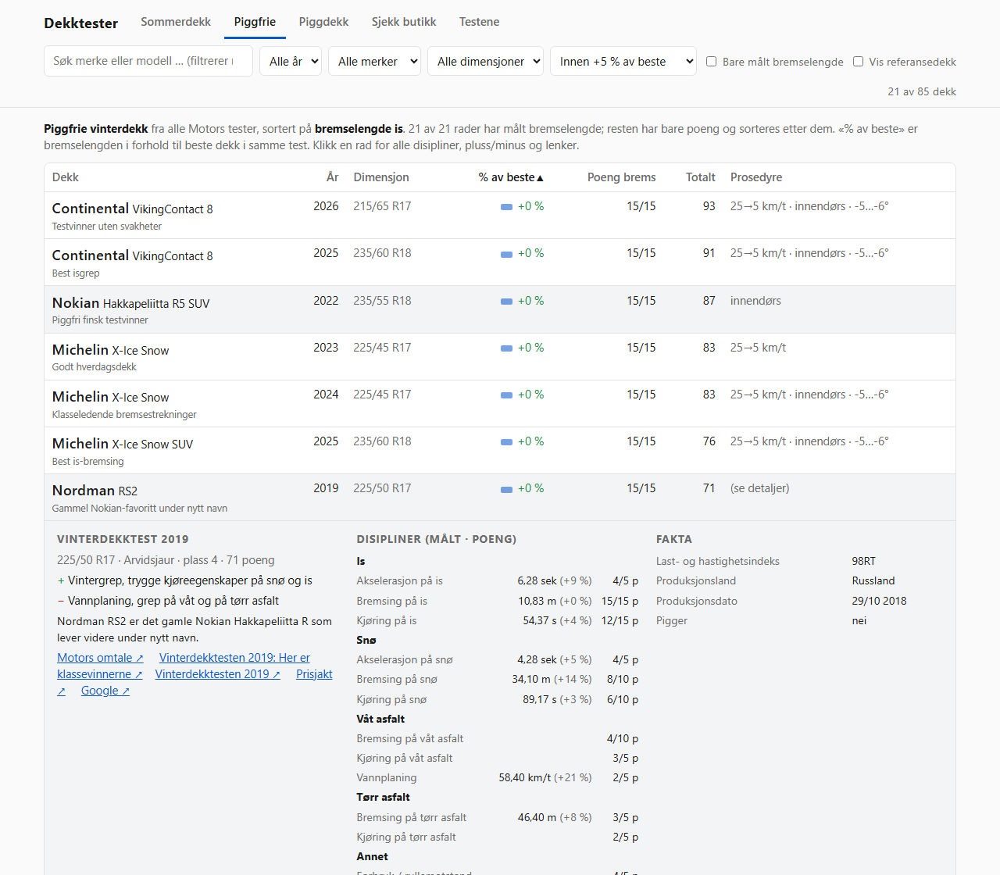
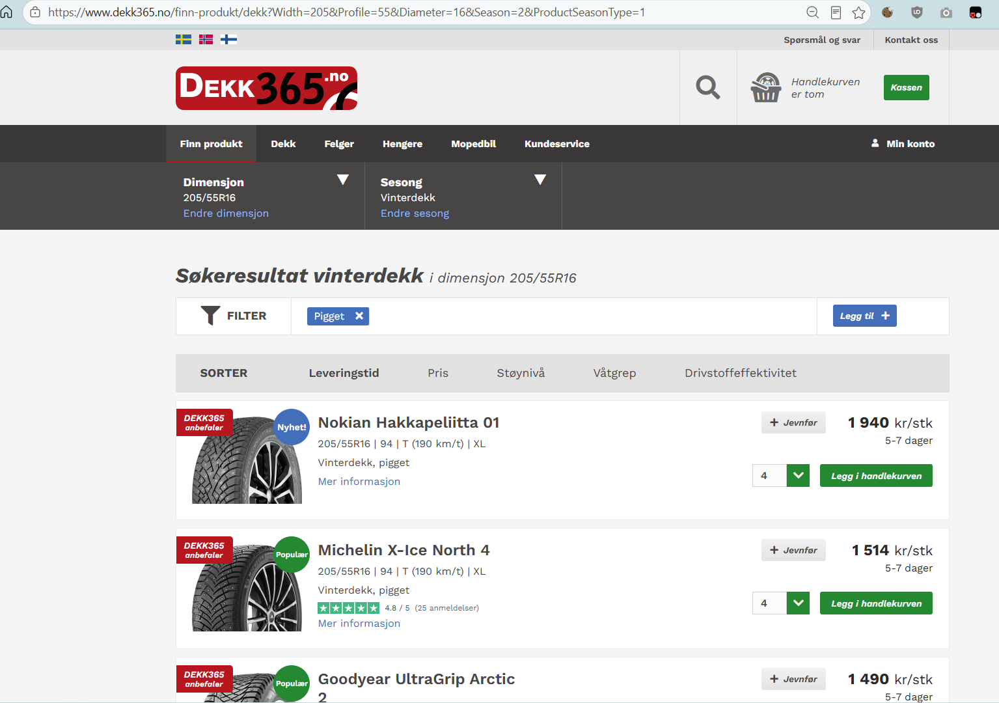
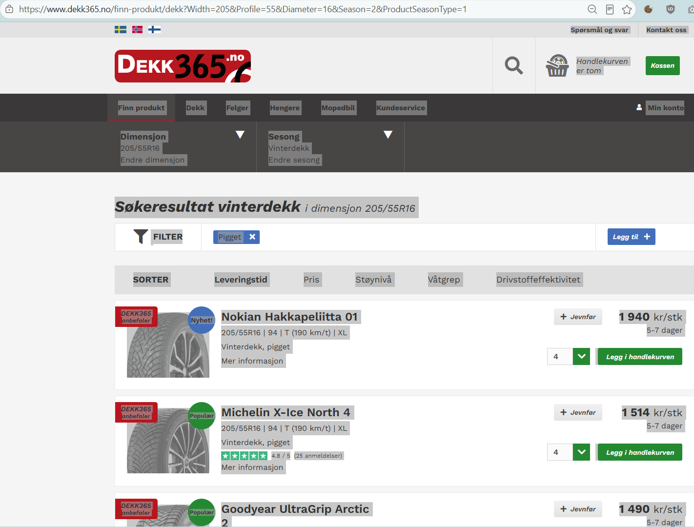
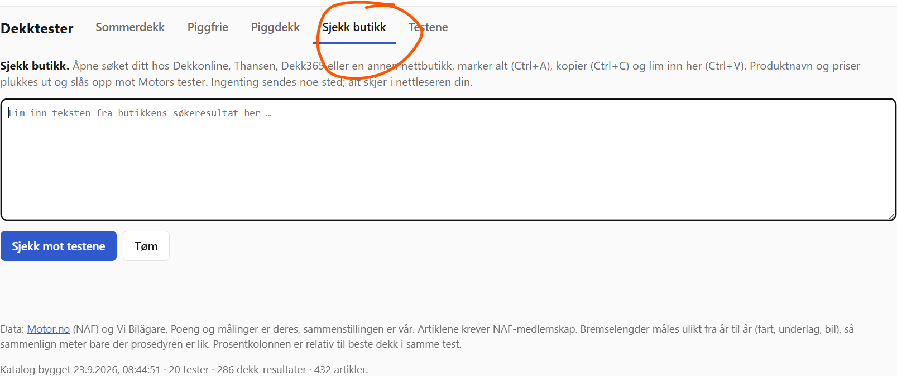
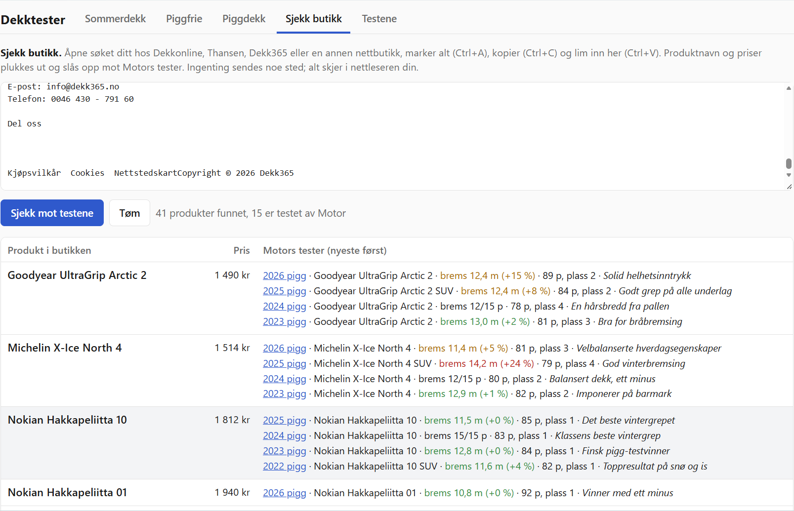

# Dekktester

**[Åpne Dekktester](https://aweussom.github.io/congenial-potato/)**

Finn dekk som bremser godt uten å måtte lete gjennom mange enkeltartikler. Siden samler [Motors dekktester](https://www.motor.no/tag/dekktester/) fra 2017 til 2026 på ett sted. Du kan søke etter merke og modell, filtrere på år og dimensjon, og åpne hvert dekk for å se flere testresultater og lenker til originalartiklene.

## Finn dekk som er gode nok

Listene legger vekt på bremselengde på **is for vinterdekk** og **våt asfalt for sommerdekk**. De sorteres som standard etter «% av beste»: forskjellen fra det beste dekket i *samme test*. Velg for eksempel «Innen +5 % av beste» for å se dekk som bremset nesten like kort som testens beste. Klikk på en rad for å se målinger, poeng, pluss og minus, og lenker til Motor.



*Piggdekk fra flere år i samme oversikt.*



*Piggfrie dekk med bremselengde innen 5 % av beste i sin test.*



*Åpne et dekk for å se hele resultatet.*

Testene bruker ulike biler, dimensjoner og målemetoder. **Ikke sammenlign antall meter direkte mellom år** uten å sjekke prosedyren. Se også på de andre disiplinene før du velger dekk. Poengskalaen kan variere mellom tester.

## Sjekk dekk fra en nettbutikk

I fanen «Sjekk butikk» kan du kopiere teksten fra en butikks søkeresultat (Ctrl+A, Ctrl+C) og lime den inn (Ctrl+V). Siden viser hvilke produkter som finnes i Motors tester, sammen med prisene den finner i teksten. Det krever ingen installasjon, og teksten behandles i nettleseren din. Funksjonen er prøvd med Dekkonline, Thansen og Dekk365. Treff på en annen variant, for eksempel SUV-utgaven, blir merket.

Eksempel med et [søk etter piggdekk hos Dekk365](https://www.dekk365.no/finn-produkt/dekk?Width=205&Profile=55&Diameter=16&Season=2&ProductSeasonType=1):

1. Finn dekkene i nettbutikken.

   

2. Trykk **Ctrl+A** og **Ctrl+C** for å kopiere teksten fra hele siden.

   

3. Åpne [Sjekk butikk](https://aweussom.github.io/congenial-potato/#/butikk) og klikk i tekstfeltet.

   

4. Trykk **Ctrl+V**. Treff og priser vises under tekstfeltet.

   

*Skjermbildene er fra 24. september 2026. Prisene er bare et eksempel og kan ha endret seg.*

## For dem som vedlikeholder siden

### Arkitektur

Samme grunnidé som [tabtabtab](https://github.com/aweussom/tabtabtab): all data ligger i én JSON-fil, og nettsiden er statisk. Katalogen er sjekket inn, så GitHub Pages trenger ingen byggesteg.

```
crawler/
  discover-tags.mjs   seeds: tag-sider -> crawler/seeds/motor-tags.json (ingen innlogging)
  crawl.mjs           henter artikkel-HTML via innlogget Chrome (chrome-devtools CLI) -> crawler/raw/
  parse.mjs           HTML -> strukturert JSON per artikkel -> crawler/parsed/
  build-catalog.mjs   parsed -> docs/data/catalog.json (tester, dekk, poeng, målinger)
docs/
  index.html, app.js, match.js, style.css   statisk nettside, leser catalog.json
```

### Hvorfor en nettleser i crawleren?

Artiklene er bak NAFs betalingsmur. Den eneste sesjonen vi har er den brukeren har logget inn med i Chrome-vinduet som `chrome-devtools`-CLI-en styrer. Crawleren kjører `fetch()` *inne i* en motor.no-tab, så cookien følger med av seg selv. Ingen passord eller tokens berører repoet. Paywall-cookien er en sesjons-cookie, så innloggingen må gjøres på nytt hver gang Chrome startes.

### Hvordan finner vi artiklene?

Motor.no kjører Labrador CMS. Enhver tag-side gir hele artikkellisten som JSON om man legger på `?lab_viewport=json`, uten paginering og uten innlogging. Enkeltdekk-artiklene (én per dekk, med poeng per disiplin) er derimot ikke tagget, så crawleren følger lenker fra hovedartiklene i to runder. Lenker som går igjen på nesten alle sider (sidemeny, «siste nytt») filtreres bort på frekvens.

### Hvordan er resultatene kodet?

Tre typer artikler per test:

1. **Hovedartikkel** med metode, dimensjon, kort om hvert dekk og (fra 2019) en poengtabell for alle dekk og disipliner.
2. **Enkeltdekk-artikkel** med en «motortest»-widget: totalpoeng, poeng per disiplin (is/snø/våt/tørr, hver delt i akselerasjon, bremselengde og kjøreegenskaper), piggantall, gummihardhet, produksjonsdato.
3. **Detaljartikkel** («alle tall og delresultater») med målte verdier per disiplin: meter, sekunder, desibel.

### Oppdatere katalogen

```sh
npm install                       # cheerio
npm i -g chrome-devtools-mcp      # nettleseren crawleren bruker
node crawler/discover-tags.mjs    # seeds
chrome-devtools new_page https://www.motor.no/   # logg inn i vinduet som åpnes
node crawler/crawl.mjs            # henter artikler; kan ta en stund
node crawler/parse.mjs
node crawler/build-catalog.mjs
npm run serve                    # forhåndsvis nettsiden på localhost:5173
```

Motor publiserer to tester i året (sommerdekk i mars, vinterdekk i september), så dette kjøres sjelden. Mens crawleren kjører bør ingen andre bruke `chrome-devtools`-CLI-en: den jobber alltid mot den *valgte* tab-en, og crawleren velger motor.no-tab-en før hver batch.

### Slik fungerer «Sjekk butikk»

Produktnavn og pris plukkes ut linje for linje, og hvert produkt slås opp mot katalogen (`docs/match.js`). En Tampermonkey-variant som merket produktene rett i butikken ble prøvd og droppet.

Matchingen normaliserer merke og modell til en kompakt nøkkel (bokstaver og tall, uten dimensjon, last-/hastighetsindeks, SUV/XL/EV og lignende), og godtar at butikken skriver «Ultra Grip» der Motor skriver «UltraGrip», eller «Goodride Z-506» der Motor skriver «IceMaster Spike Z-506». Varianter (SUV-utgaven er testet, butikken selger standardutgaven) merkes som variant.

Navnene i katalogen er kanonisert med en håndlaget tabell, `crawler/seeds/name-fixes.json`, fordi Motor staver samme dekk ulikt fra år til år. Ingen gjetting i kjøretid, ingen LLM: tabellen utvides for hånd når en ny testsesong gir nye skrivemåter.

### Hosting

Nettsiden ligger i `docs/` slik at GitHub Pages kan serve den rett fra `main`: Settings → Pages → «Deploy from a branch» → `main` / `/docs`. `docs/.nojekyll` skrur av Jekyll. Katalogen (`docs/data/catalog.json`, ca. 1 MB) er sjekket inn, så siden trenger ingen byggesteg.

Rå-HTML (`crawler/raw/`) og de parsede artiklene (`crawler/parsed/`) er ikke i repoet: kilden er bak betalingsmur. Katalogen inneholder bare tall (poeng, meter, sekunder), Motors énlinjes dom per dekk og pluss/minus-frasene, med lenke til artikkelen for resten.
